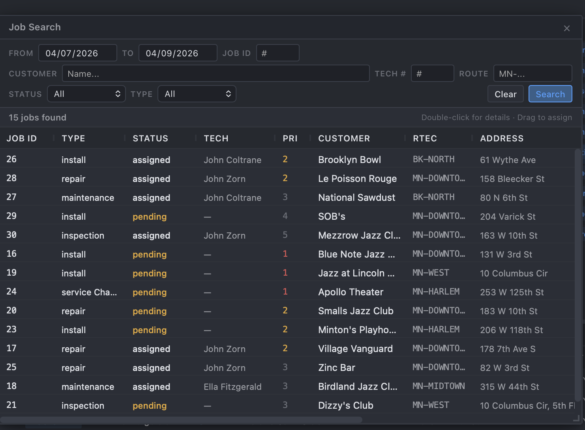
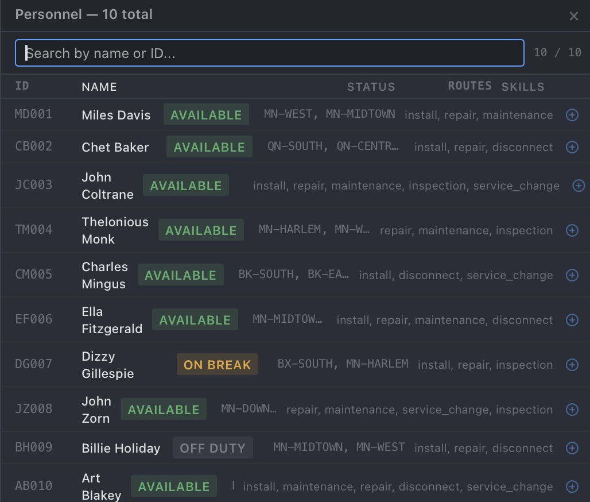

## Overview

An open-source field service management system built with FastAPI, PostgreSQL, Vite, and React. FieldOpt is an enterprise-grade dispatch console designed for dispatchers and field service companies to efficiently assign, route, and manage service jobs across a workforce of field technicians.

<table align="center">
	<tr>
		<td colspan="2" align="center">
			<br/>
			Dispatch Console
		</td>
	</tr>
	<tr>
		<td align="center">
			<br/>
			Job Search
		</td>
		<td align="center">
			<br/>
			Map in Second Window
		</td>
	</tr>
	<tr>
	<td align="center">
			<br/>
			Route Filter Display
		</td>
		<td align="center">
			<br/>
			Personal Display
		</td>
	</tr>
</table><br>

**Auto-Router** — Automatically assigns jobs to the best qualified technicians

**Skill-Based Matching** — Ensures technicians only get jobs they're qualified for (manual override capable)

**Capacity Management** — Prevents overbooking by tracking tech workload

**Route Criteria & Management Areas** — Techs are assigned geographic zones; jobs carry route criteria for zone-aware dispatch

**Enterprise Dispatch Console** — AG Grid-powered split-pane layout with right-click context menus, drag-and-drop assignment, multi-select batch operations, tech timeline, day picker, floating filter/search/personnel windows, and a detachable map popup for multi-monitor setups

## Launch FieldOpt

### Requirements

- Python 3.11+
- pip and npm
- Docker or PostgreSQL 15+

### Run

#### Backend

```bash
cd fieldopt
pip install -r requirements.txt

# Start PostgreSQL
docker compose up -d postgres

# Start the API
python -m uvicorn backend.api.main:app --reload
```

#### Frontend

```bash
cd fieldopt/frontend
npm install
npm run dev
```

#### Access

| Service | URL |
|---------|-----|
| Frontend | http://localhost:5173 |
| API | http://localhost:8000 |
| Swagger Docs | http://localhost:8000/docs |
| ReDoc | http://localhost:8000/redoc |

#### Seed & Reset

```bash
# Seed the database with sample data
python -m backend.database.seeds.seed_data

# Reset database (drop all tables + reseed)
python -m backend.database.reset_db

# Reset database (empty, no seed data)
python -m backend.database.reset_db --empty
```

#### Environment

```bash
cp .env.example .env
# Edit .env — defaults work for development
```

## Routing
### Routing Modes

- `standard` — Closest qualified tech
- `load_balance` — Distributes workload across all techs
- `standard_by_timeslot` — Considers time slots (future enhancement)

### How It Works

The routing engine evaluates multiple factors to find the best technician for each job:
1. **Skill** — Technician must have all required skills
2. **Route** — Job's route criteria must match one of the tech's assigned management areas
3. **Time** — Technician must have time available in their shift
4. **Capacity** — Won't exceed configurable max jobs per day
5. **Distance** — Assigns closest qualified tech (haversine calculation)
6. **Priority** — VIP and high-priority jobs routed first

### Job Evaluation

When assigning a job to a technician, the system evaluates three criteria and warns if any fail:
- **Skill** ✓/✕ — Does the tech have the required skills?
- **Route** ✓/✕ — Is the job in the tech's assigned management area?
- **Time** ✓/✕ — Does the tech have enough shift time remaining?
If any check fails, the dispatcher receives a warning with details but can override the assignment.

## Keyboard Shortcuts

| Key | Action |
|-----|--------|
| `R` | Refresh data |
| `M` | Toggle map |
| `T` | Toggle timeline |
| `F` | Toggle display filter |
| `P` | Open personnel window |
| `J` | Open job search |
| `A` | Auto-route (with confirmation) |
| `Esc` | Close windows / context menus |

## API
### Key Endpoints

#### Technicians
- `POST /api/v1/technicians/` — Create technician
- `GET /api/v1/technicians/` — List all (includes assigned/completed job counts, assigned routes)
- `GET /api/v1/technicians/available` — Get available techs
- `PATCH /api/v1/technicians/{id}/status` — Update status
- `PATCH /api/v1/technicians/{id}/location` — Update location
- `GET /api/v1/technicians/{id}/workload` — Get workload
#### Jobs
- `POST /api/v1/jobs/` — Create job (supports route_criteria)
- `GET /api/v1/jobs/` — List all (supports `?scheduled_date=` filter, includes assigned tech)
- `GET /api/v1/jobs/pending` — Get unassigned jobs
- `GET /api/v1/jobs/summary` — Job counts by status (supports `?target_date=`)
- `GET /api/v1/jobs/search/query` — Multi-criteria search (date range, tech, customer, status, type, route)
- `POST /api/v1/jobs/{id}/start` — Start a job
- `POST /api/v1/jobs/{id}/complete` — Complete a job
- `POST /api/v1/jobs/{id}/cancel` — Cancel a job
- `GET /api/v1/jobs/{id}/can-do/{tech_id}` — Full Job evaluation (skill, route, time, distance)
#### Assignments
- `POST /api/v1/assignments/` — Assign job to tech
- `POST /api/v1/assignments/unassign` — Unassign a job
- `POST /api/v1/assignments/reassign` — Reassign to different tech
- `POST /api/v1/assignments/batch-assign` — Assign multiple jobs to one tech
- `POST /api/v1/assignments/batch-unassign` — Unassign multiple jobs
#### Routing
- `POST /api/v1/routing/auto-route` — Auto-assign all pending jobs
- `GET /api/v1/routing/best-tech/{job_id}` — Find best tech for a job

## Change Log

### 0.0.7 (Latest)
Windows, search, route criteria, map popup
- **Display Filter Window** — Multi-select filter by time slot, job type, route criteria, and technician with Select All / None / Reset. Stacks with dashboard bar filters.
- **Personnel Window** — Searchable list of all technicians regardless of schedule. Right-click for context actions, double-click for detail, locate-in-grid button.
- **Job Search Window** — Multi-criteria search (date range, job ID, tech #, customer name, status, type, route criteria). Full AG Grid results with all columns matching the main display. Right-click and double-click support. Drag from search results onto a tech in the R&D.
- **Job Detail Panel** — Double-click any job (main grid or search results) for full detail view: customer, address, route criteria, schedule, assignment, skills, description, notes, timestamps.
- **Map as real OS popup** — Map opens via `window.open()` as a standalone window for multi-monitor setups. Syncs live data via BroadcastChannel. Falls back to in-page floating window if popup is blocked.
- **Route Criteria / Management Areas** — `route_criteria` field on jobs, `assigned_routes` on technicians. 13 NYC management areas in seed data. Route criteria column in job grid, routes column in tech grid.
- **Job evaluation** — Expanded from skill-only to skill + route + time checks with haversine distance calculation. Override warning modal on assign with ✓/✕ indicators for each check.
- **Auto-route confirmation** — Auto-route now prompts for confirmation before executing.
- **Toolbar** — Filter, Personnel, Job Search buttons in header bar.
- **Keyboard shortcuts** — F (filter), P (personnel), J (job search), A (auto-route).
- **Backend** — `GET /jobs/search/query` endpoint, expanded Job Evaluation endpoint, route_criteria on all job schemas.
- Header and dashboard bar scroll gracefully on narrow windows.

### Previous Versions
<details>
<summary>Previous Changes</summary>

***0.0.6***<br>
Dispatch interactivity + batch operations
- Day picker with date-filtered API calls (navigate days, all views scoped to selected date)
- Multi-select: Cmd/Ctrl+click to toggle, Shift+click for range (respects AG Grid sort order)
- Independent grid selections (select techs for timeline while selecting jobs for assignment)
- Batch assign/unassign via single API call and single DB transaction
- Batch tech status changes (select multiple techs, right-click → set all to available/break/off duty)
- Drag-and-drop job assignment (drag from job grid, drop on tech row)
- Multi-job drag (select multiple jobs, drag one → all selected assign to target tech)
- Tech timeline pane (toggle-able, shows hour blocks with job assignments, stacks overlapping jobs)
- Resizable timeline divider
- Jobs A:C column now shows real assigned/completed counts
- Job grid "Tech" column shows assigned technician name
- API responses now include assignment data (assigned_tech_id/name on jobs, job counts on techs)
- Skill-filtered context menus with multi-select awareness
- Context menu shows batch operations when multiple items selected

***0.0.5***<br>
Complete frontend redesign — enterprise dispatch console
- AG Grid-powered split-pane layout (technicians top, jobs bottom)
- Draggable divider between panes
- Right-click context menus with skill-filtered tech assignment
- Clickable dashboard indicator bar (filters grids by status)
- Floating, draggable, resizable map window (Leaflet)
- Toast notifications on all dispatch actions
- Keyboard shortcuts (R = refresh, M = map, T = timeline, Esc = close)
- Dropped Tailwind — handwritten enterprise CSS with dark theme
- Expanded API client (all endpoints wired)
- Jazz-themed seed data

***0.0.4***<br>
Async backend migration + bug fixes
- SQLAlchemy async engine with asyncpg
- Fixed delete_technician, workload signature, reassign atomicity
- Fixed get_jobs_summary filter bug
- lazy="selectin" on all relationships
- Routing now uses current tech location over home base

***0.0.3***<br>
Project restructuring + frontend
- Fully backend-driven
- PostgreSQL over SQLite
- Map view via OpenStreetMap/Leaflet
- Vite + React + Tailwind frontend

***0.0.2***<br>
Started frontend
- FastAPI + React integration
- Technician + job CRUD via API
- Basic frontend displaying techs/jobs

***0.0.1***<br>
Initial commit
- Basic backend logic
- Proof of concept
</details>

## Roadmap

- [x] Drag-and-drop job assignment
- [x] Day picker with date-filtered views
- [x] Multi-select and batch operations
- [x] Tech timeline pane
- [x] Display filter window (time slot, job type, route criteria, tech)
- [x] Tech/staff search window (personnel)
- [x] Job search window (multi-criteria)
- [x] Map as real popup window (second monitor support)
- [x] Route criteria / management areas
- [x] Job evaluation (skill/route/time + distance)
- [x] Override warning on assignment mismatch
- [ ] Job visual column (per-job evaluation mode on tech grid)
- [ ] Dark/light theme toggle
- [ ] Account system with role-based access
- [ ] Column state persistence per user
- [ ] Automated dispatch (job drip — system assigns jobs as they arrive)
- [ ] WebSocket real-time updates
- [ ] Mobile technician PWA
- [ ] Docker compose full stack
- [ ] Hosted live demo

## Contributing

If you share the belief that simplicity empowers creativity, feel free to contribute.
- Fork this repo
- Submit a Pull Request
- Bug reports and feature requests

Please ensure your code follows the existing style.

