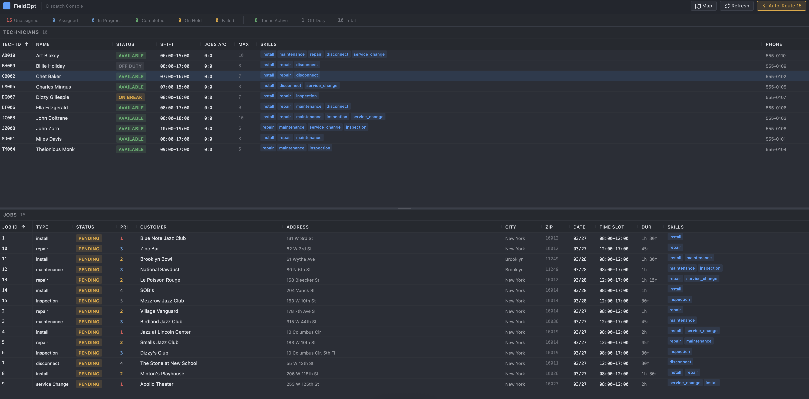
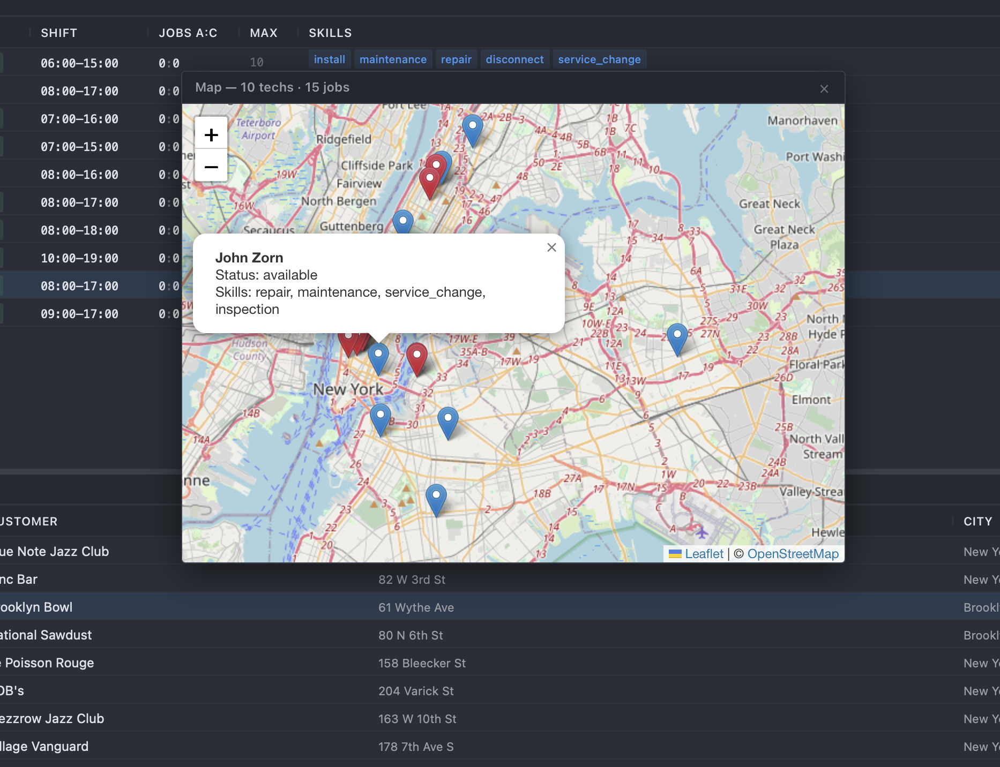
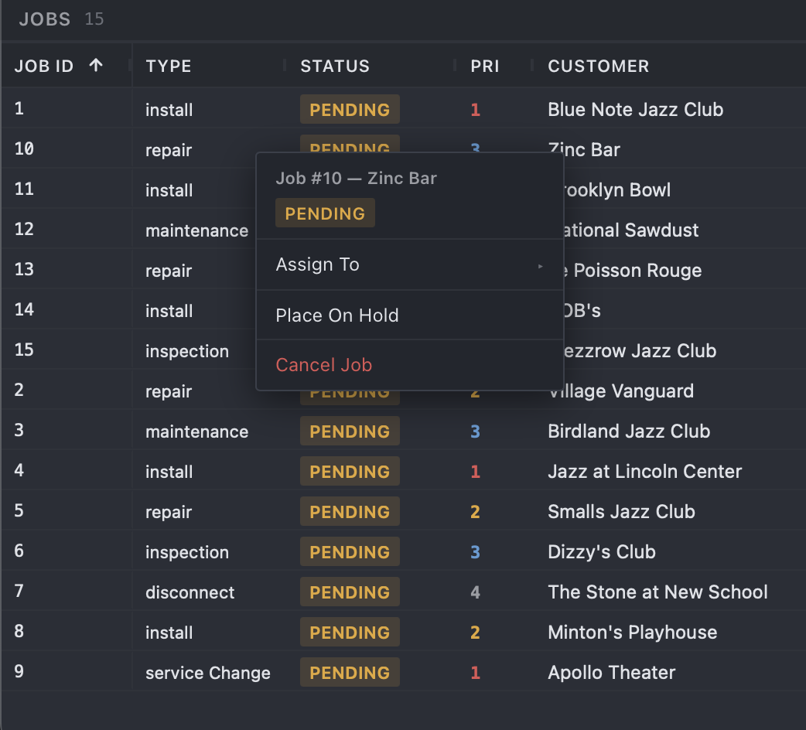

# FieldOpt

## Overview

An open-source field service management system built with FastAPI, PostgreSQL, Vite, and React. FieldOpt is an enterprise-grade dispatch console designed for dispatchers and field service companies to efficiently assign, route, and manage service jobs across a workforce of field technicians.

<table align="center">
	<tr>
		<td colspan="2" align="center">
			<br/>
			[Dashboard]
		</td>
	</tr>
	<tr>
		<td align="center">
			<br/>
			[Map View]
		</td>
		<td align="center">
			<br/>
			[Assign Jobs]
		</td>
	</tr>
</table><br>

**Auto-Router** — Automatically assigns jobs to the best qualified technicians

**Skill-Based Matching** — Ensures technicians only get jobs they're qualified for (manual override capable)

**Capacity Management** — Prevents overbooking by tracking tech workload

**Enterprise Dispatch Console** — AG Grid-powered split-pane layout with right-click context menus, drag-and-drop assignment, clickable dashboard indicators, and a floating map window

## Launch FieldOpt

### Requirements

- Python 3.11+
- pip and npm
- Docker or PostgreSQL 15+

### Run

#### Backend

```bash
cd fieldopt
pip install -r requirements.txt

# Start PostgreSQL
docker compose up -d postgres

# Start the API
python -m uvicorn backend.api.main:app --reload
```

#### Frontend

```bash
cd fieldopt/frontend
npm install
npm run dev
```

#### Access

| Service | URL |
|---------|-----|
| Frontend | http://localhost:5173 |
| API | http://localhost:8000 |
| Swagger Docs | http://localhost:8000/docs |
| ReDoc | http://localhost:8000/redoc |

#### Seed & Reset

```bash
# Seed the database with sample data
python -m backend.database.seeds.seed_data

# Reset database (drop all tables + reseed)
python -m backend.database.reset_db

# Reset database (empty, no seed data)
python -m backend.database.reset_db --empty
```

#### Environment

```bash
cp .env.example .env
# Edit .env — defaults work for development
```

## Routing

### Routing Modes

- `standard` — Closest qualified tech
- `load_balance` — Distributes workload across all techs
- `standard_by_timeslot` — Considers time slots (future enhancement)

### How It Works

The routing engine evaluates multiple factors to find the best technician for each job:

1. **Skill** — Technician must have all required skills
2. **Time** — Technician must have time available in their shift
3. **Capacity** — Won't exceed configurable max jobs per day
4. **Distance** — Assigns closest qualified tech (in standard mode)
5. **Priority** — VIP and high-priority jobs routed first

## API

### Key Endpoints

#### Technicians
- `POST /api/v1/technicians/` — Create technician
- `GET /api/v1/technicians/` — List all technicians
- `GET /api/v1/technicians/available` — Get available techs
- `PATCH /api/v1/technicians/{id}/location` — Update location
- `PATCH /api/v1/technicians/{id}/status` — Update status
- `GET /api/v1/technicians/{id}/workload` — Get workload

#### Jobs
- `POST /api/v1/jobs/` — Create job
- `GET /api/v1/jobs/` — List all jobs
- `GET /api/v1/jobs/pending` — Get unassigned jobs
- `GET /api/v1/jobs/summary` — Job counts by status
- `POST /api/v1/jobs/{id}/start` — Start a job
- `POST /api/v1/jobs/{id}/complete` — Complete a job
- `POST /api/v1/jobs/{id}/cancel` — Cancel a job
- `GET /api/v1/jobs/{id}/can-do/{tech_id}` — Check tech qualification

#### Assignments
- `POST /api/v1/assignments/` — Assign job to tech
- `POST /api/v1/assignments/unassign` — Unassign a job
- `POST /api/v1/assignments/reassign` — Reassign to different tech

#### Routing
- `POST /api/v1/routing/auto-route` — Auto-assign all pending jobs
- `GET /api/v1/routing/best-tech/{job_id}` — Find best tech for a job

## Change Log

### 0.0.5 (Latest)
Complete frontend redesign — enterprise dispatch console

- AG Grid-powered split-pane layout (technicians top, jobs bottom)
- Draggable divider between panes
- Right-click context menus with skill-filtered tech assignment
- Clickable dashboard indicator bar (filters grids by status)
- Floating, draggable, resizable map window (Leaflet)
- Toast notifications on all dispatch actions
- Keyboard shortcuts (R = refresh, M = map, Esc = close)
- Dropped Tailwind — handwritten enterprise CSS with dark theme
- Expanded API client (all endpoints wired)
- Jazz-themed seed data

### 0.0.4
Async backend migration + bug fixes

- SQLAlchemy async engine with asyncpg
- Fixed delete_technician, workload signature, reassign atomicity
- Fixed get_jobs_summary filter bug
- lazy="selectin" on all relationships
- Routing now uses current tech location over home base

### Previous Versions
<details>
<summary>Previous Changes</summary>

***0.0.3***<br>
Project restructuring + frontend
- Fully backend-driven
- PostgreSQL over SQLite
- Map view via OpenStreetMap/Leaflet
- Vite + React + Tailwind frontend

***0.0.2***<br>
Started frontend
- FastAPI + React integration
- Technician + job CRUD via API
- Basic frontend displaying techs/jobs

***0.0.1***<br>
Initial commit
- Basic backend logic
- Proof of concept
</details>

## Roadmap

- [ ] Drag-and-drop job assignment (cross-grid drop detection)
- [ ] CanDo column (skill/route/time check indicators per WFX)
- [ ] Dark/light theme toggle
- [ ] Account system with role-based access
- [ ] Column state persistence per user
- [ ] Automated dispatch (job drip — system assigns jobs as they arrive)
- [ ] Route criteria / designated tech zones
- [ ] WebSocket real-time updates
- [ ] Mobile technician PWA
- [ ] Docker compose full stack

## Contributing

If you share the belief that simplicity empowers creativity, feel free to contribute.

- Fork this repo
- Submit a Pull Request
- Bug reports and feature requests

Please ensure your code follows the existing style.

