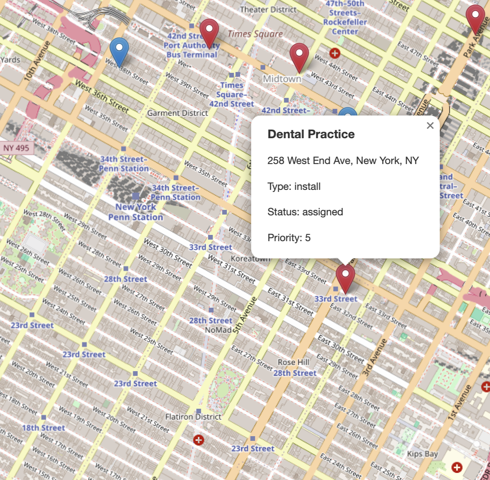
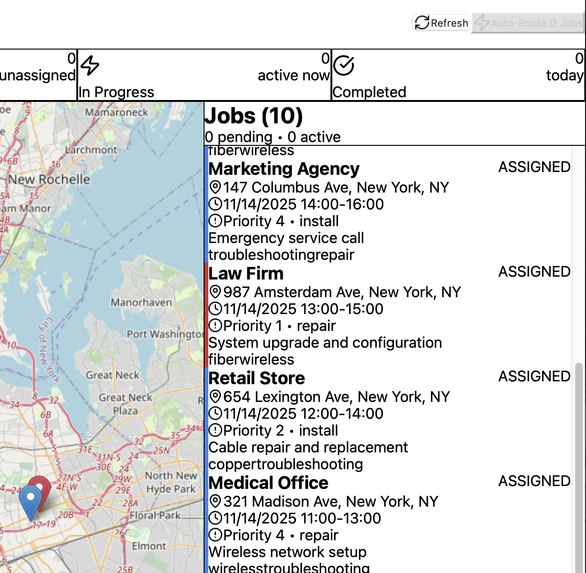
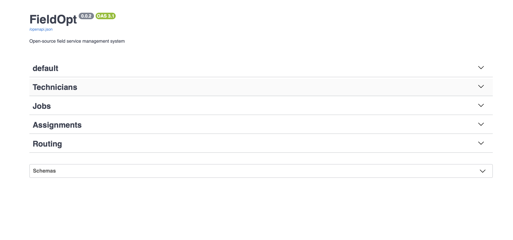
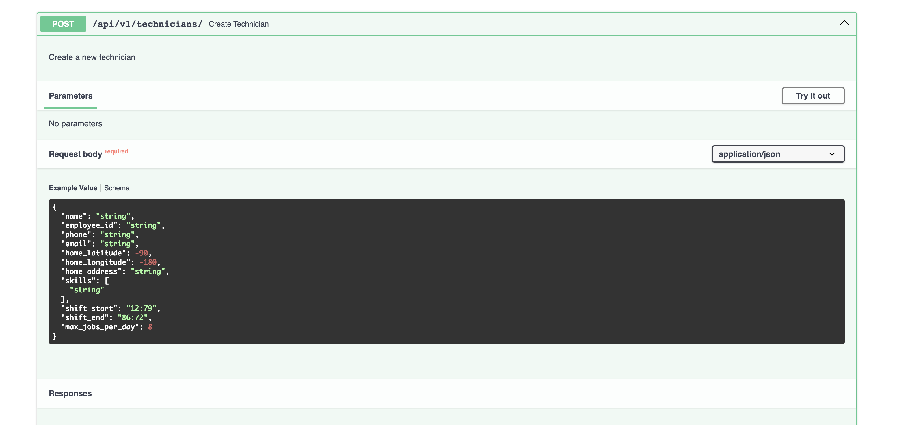

# FieldOpt
## Overview
An open source field service management system built using FastAPI, PostgresSQL, Vite, and React. Currently at around 30+ API endpoints. It's capable of creating technicians and jobs (backend), managing them, assigning jobs to technicians based on skill, and tracking technicians locations, in addition to job states (backend & frontend). FieldOpt helps dispatchers and field service companies efficiently assign and route service jobs to technicians.

<p align="center">
	<br>
</p><br>
<table align="center">
	<tr>
		<td align="center">
			<br/>
			[Dot View]
		</td>
		<td align="center">
			<br/>
			[Job View]
		</td>
	</tr>
		<tr>
		<td align="center">
			<br/>
			[Swagger API Backend]
		</td>
		<td align="center">
			<br/>
			[JSON Entry]
		</td>
	</tr>
</table><br>

**Auto-Router**: Automatically assigns jobs to the best qualified technicians  

**Skill-Based Matching**: Ensures technicians only get jobs they're qualified for (manual override capable)

**Capacity Management**: Prevents overbooking by tracking tech workload

## Launch FieldOpt

### Requirements

- Python 3.11+
- pip and npm
- Docker or PostgreSQL 15+

### Run

#### Backend

Create virtual environment<br>
Install dependencies<br>
Start PostgreSQL via included docker yml or local install<br>
Run server
```bash
pip install -r requirements.txt

# For Docker
<Start Docker>
docker compose up -d postgres

cd fieldopt
python -m uvicorn backend.api.main:app
```
#### Frontend

Install dependencies<br>
Run server
```bash
cd fieldopt/frontend
npm install
npm run dev
```

#### Access the API
API: http://localhost:8000 <br>
Interactive Docs: http://localhost:8000/docs <br>
Alternative Docs: http://localhost:8000/redoc <br>
Frontend: http://localhost:5173 <br>

#### Optional 

##### Seeding a database
```bash
cd fieldopt/backend/database/
python -m backend.database.seeds.seed_data
```
##### Setting up an environment
```bash
cp .env.example .env
# Edit .env (defaults work for development)
```

## Routing

### Routing Modes

- `standard` - Closest qualified tech
- `load_balance` - Balances workload across all techs
- `standard_by_timeslot` - Considers time slots (future enhancement)

### Operation

The routing engine considers multiple factors to find the best technician for each job:

1. **Skill**: Technician must have all required skills
2. **Time**: Technician must have time available in their day
3. **Capacity**: Won't overload a tech (configurable max jobs per day)
4. **Distance**: Assigns closest qualified tech (in standard mode)
5. **Priority**: VIP and high-priority jobs routed first

## API Interaction

### Key Endpoints

#### Technicians
- `POST /api/v1/technicians/` - Create technician
- `GET /api/v1/technicians/` - List all technicians
- `GET /api/v1/technicians/available` - Get available techs
- `PATCH /api/v1/technicians/{id}/location` - Update location
- `PATCH /api/v1/technicians/{id}/status` - Update status

#### Jobs
- `POST /api/v1/jobs/` - Create job
- `GET /api/v1/jobs/` - List all jobs
- `GET /api/v1/jobs/unassigned` - Get unassigned jobs
- `PATCH /api/v1/jobs/{id}/start` - Start a job
- `PATCH /api/v1/jobs/{id}/complete` - Complete a job

#### Routing
- `POST /api/v1/routing/auto-route` - Auto-assign all pending jobs
- `POST /api/v1/routing/jobs/{id}/route` - Route single job
- `POST /api/v1/routing/jobs/{id}/assign/{tech_id}` - Manual assign
- `DELETE /api/v1/routing/jobs/{id}/unassign` - Unassign job
- `POST /api/v1/routing/jobs/{id}/reassign/{tech_id}` - Reassign job


## Configuration

Edit `backend/.env` to customize routing behavior, time slots, etc.

## Change Log

### 0.0.4 (Latest)<br>
Async backend migration + bug fixes
- SQLAlchemy async engine with asyncpg
- Fixed delete_technician, workload signature, reassign atomicity
- Fixed get_jobs_summary filter bug
- lazy="selectin" on all relationships
- Routing now uses current tech location over home base
- Frontend CSS fixes — Tailwind v4, full viewport layout

### Previous Versions
<details>
<summary>Previous Changes</summary>

***0.0.3***<br>
Project restructuring + frontend
- Fully backend-driven
- PostgresSQL over SQLite
- Beautiful and responsive map view, thanks to the OpenStreetMap library
- Redesigned tailwind css vite + react frontend

***0.0.2***<br>
Started frontend
- FastAPI + react integration; "it isn't pretty but it's scaffolded"
- Technician + job CRUD via API
- Technically live frontend that displays techs/jobs

***0.0.1***<br>
Initial commit
- Basic backend logic
- More of a proof of concept
</details>

## Roadmap
[ ] Docker compose full stack (frontend + backend + postgres)<br>
[ ] WebSocket real-time dispatch updates<br>
[ ] Dispatch dashboard with live counters
[ ] Mobile technician PWA<br>
[ ] Refine auto-dispatching

## Contributing
If you share the belief that simplicity empowers creativity, feel free to contribute.

#### Contribution is welcome in the form of
- Forking this repo
- Submitting a Pull Request
- Bug reports and feature requests

Please ensure your code follows the existing style.
